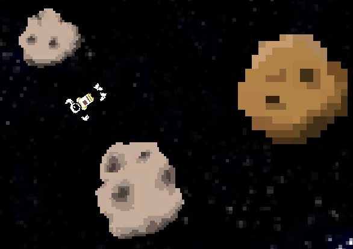

## 14 Seconds

This is the game _14 Seconds_, made on a train from Chicago to
San Francisco for [TrainJam](http://www.trainjam.com) 2014.

Binaries are available [here](http://trainjam.com/?s=14+seconds&post_type=game).

### Description

Disconnected, you have only 14 seconds to make it back to the
space station before you run out of oxygen! As you gradually
suffocate, it becomes more and more difficult to go on...

AKA: _Gravity meets QWOP_, or _Space QWOP_.

### Controls

#### Keys

* **D**: left hand
* **F**: left arm
* **V**: left leg
* **K**: right hand
* **J**: right arm
* **N**: right leg
* **ESCAPE**: restart

#### Tips

1. REACH by holding the HAND key
2. GRAB by holding the HAND key
3. PULL in by releasing the ARM key
4. RELEASE by releasing the HAND key
5. PUSH by holding the ARM key

### Credits

#### Programming/Design

[Adriaan de Jongh](http://twitter.com/AdriaandeJongh)

[Mikayla Hutchinson](http://twitter.com/mjhutchinson)

#### Art

[Eline Muijres](http://twitter.com/ElineMuijres)

#### Sound

[Kris Graft](http://twitter.com/krisgraft)

#### Special Thanks

[Adriel Wallick](http://twitter.com/msminotaur)
 
[Andrew Gleeson](http://twitter.com/_andrio)

[Rami Ismail](http://twitter.com/tha_rami)

### License

_14 Seconds_ is copyright (C) 2014 by the authors. Its code is available under the [MIT License](http://opensource.org/licenses/MIT), and its art, sound and other assets are available under the
[Creative Commons Attribution-ShareAlike 4.0 License](http://creativecommons.org/licenses/by-sa/4.0)

